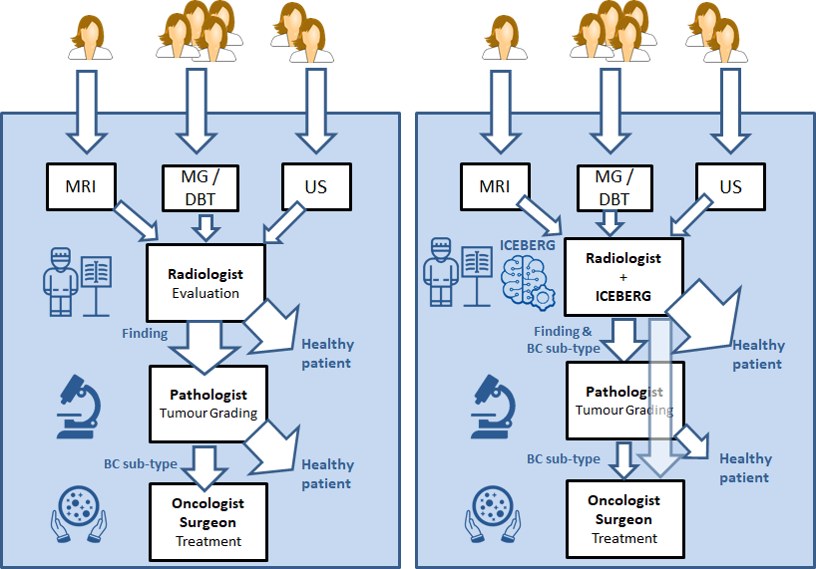
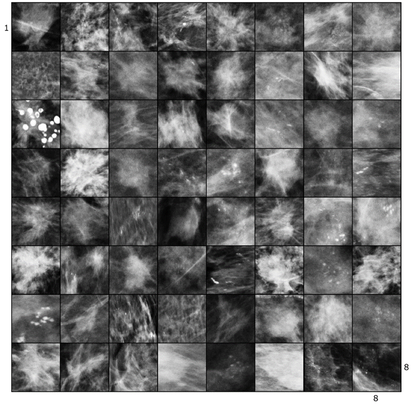
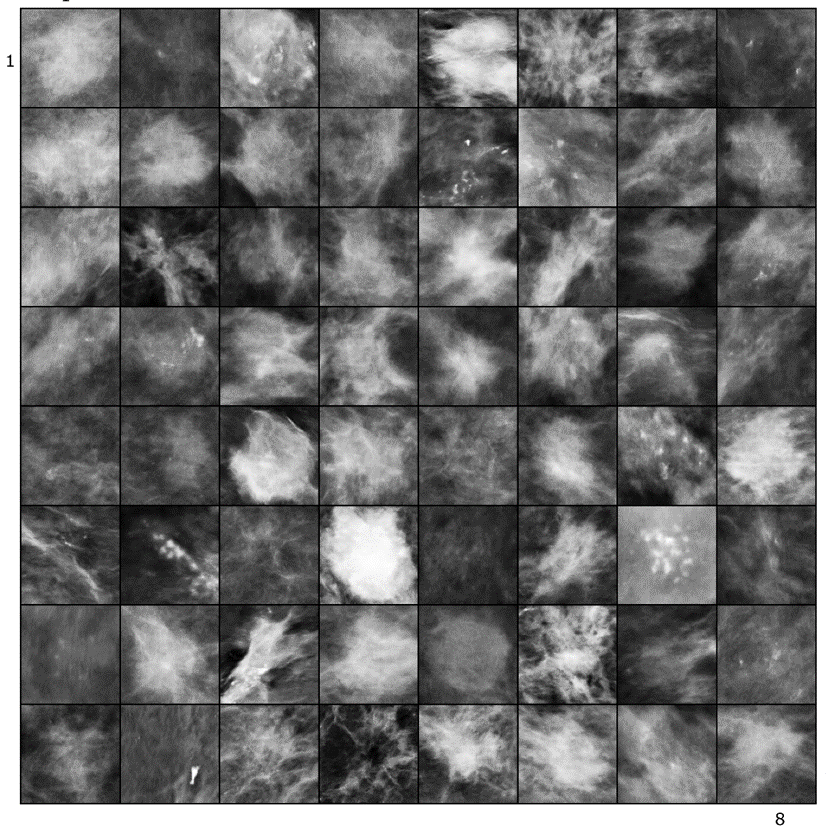
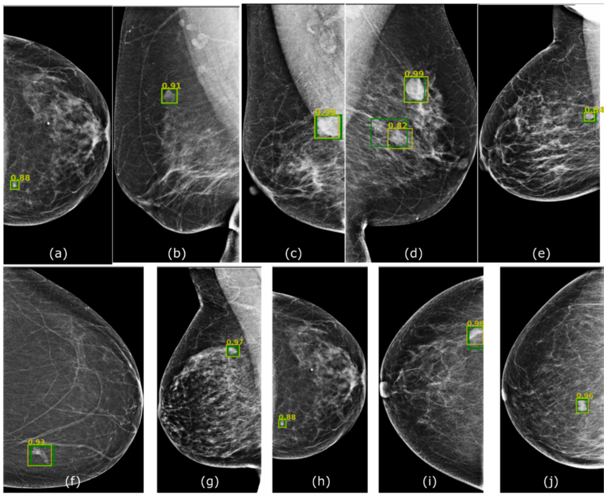
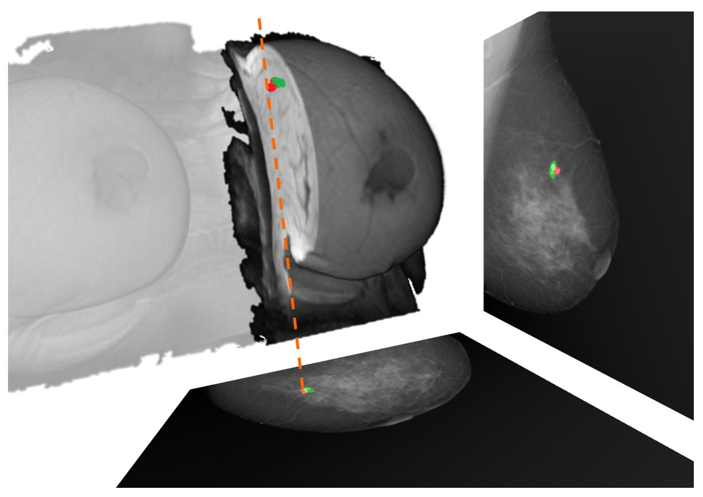
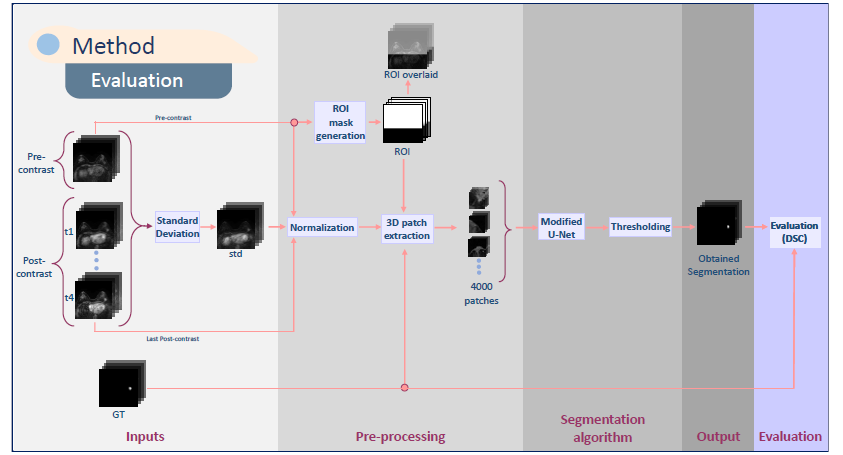

## Welcome to the ICEBERG Project Web page

**ICEBERG**: Image Computing for Enhancing Breast Cancer Radiomics

**Project reference**: RTI2018-096333-B-I00 Spanish 

**Project Leader**: Robert Martí Marly

**Budget**: 150.040€

**Duration**: 2019-2021

**ABSTRACT**
Breast cancer screening has had a major impact on reducing mortality. In breast screening programmes, standard mammography (MG) is the most commonly used modality to diagnose breast cancer, although in certain patients other modalities such as magnetic resonance imaging (MRI) or ultrasound (US) provide complimentary information.
Absolute certainty about a breast cancer finding is obtained by performing a biopsy. This biopsy sample is analysed by pathologists in order to assess tumour type, growth, grading, aggressiveness and other clinical data that will be used not only for the diagnosis but also to define the most adequate treatment.
It is widely accepted that breast cancer treatment not only depends on the stage at which the cancer has been detected but also on its molecular structure, being some cancers more aggressive than others. For instance the triple negative breast cancer (TNBC) is one of the most aggressive for which is also difficult to find an effective treatment. There is also early evidence that imaging features could provide significant information to discriminate molecular sub-types.

**Hypothesis**:
The main hypothesis of ICEBERG is that imaging features obtained using medical image computing methods can provide enough discriminative power to predict breast cancer sub-types at an early stage. Deep learning methods, specially convolutional neural networks, together with the technological improvement of the GPUs have increased the capability to extract richer features and to learn deeper models. In breast imaging this can be crucial to improve the performance of current state-of-the-art methods but also to extract novel and more complex radiomic features that can help in predicting molecular cancer sub-types. This could have an impact in breast screening: improving early diagnosis, less biopsies and lower recall rates and allowing a faster, personalised and targeted treatment.

**Objective**:
To develop novel radiomic features based on the analysis of breast images taking into account lesions and glandular structure. Those radiological features will be used to develop methods for the detection and classification of breast cancer molecular sub-types, specially TNBC. Algorithms developed will be based on deep learning techniques using state of the art GPU systems and paradigms focusing on adversarial networks and variations of convolutional neural networks (CNNs).

Although the main research team is from the University of Girona, to develop the ICEBERG project we have put together a multidisciplinary team of experts in computer vision and image analysis, oncology and radiology from Spanish and international research centers and hospitals.

# Results
Here you can see initial results for the project. For more info see realted publications or contact me (robert.marti {at} udg.edu)

## Synthetic Lesion Generation in Mammography
We use GANs for generating synthetic mammographic lesions. This has proven to provide realistic data augmentation for subsequent lesion detection CAD systems. Here is an example of real and fake (synthetic) lesion.

## Lesion Detection in Mammography
We have proposed several architectures based on deep learning for the detection of lesions in X-ray mammopgrahy and have tested them in different datasets, to experiment transfer learning and adaptation capabilities. 

## 2D-3D MRI to X-ray correspondence
We have developed a fully automatic method for corresponding lesions (or any other interesting tissue) in breast 3D MRI and X-ray (2D) mammography. This can be very useful for multi-modal lesion correspondence, lesion simulation and creating phantoms for virtual clinical trials (VCT).  

## MRI lesion detection & segmentation in DCE-MRI
We have developed a framework for the segmentation and detection of lesions based on U-Net networks. Main contributions are the evaluation of different aspects such as input volumes, patch sizes and sampling and U-net configurations.  

# Publications

## Journals
- [AIIM20] Moi Hoon Yap, Manu Goyal, Fatima Osman, Marti Robert, Erika Denton, Arne Juette, Reyer Zwiggelaar Breast Ultrasound Region of Interest Detection and Lesion Localisation. Artificial Intelligence in Medicine (accepted), 2020. [IF 3.574, Q1 (5/26) MI]

- [CBM20a] Richa Agarwal, Oliver Díaz, Moi Hoon Yap, Xavier Lladó, Robert Martí Deep learning for mass detection in Full Field Digital Mammograms. Computers in Biology and Medicine, 121, 103774, 2020. [IF 2.79, Q2]

- [JMI19] R. Agarwal, O.Diaz, X.Lladó, M.H. Yap, R. Martí [Automatic mass detection in mammograms using deep convolutional neural networks](https://doi.org/10.1117/1.JMI.6.3.031409) J. Med. Imag. 6(3) 031409, 2019.

 
## Conferences
- [AIHA20] Roa'A Khaled, Joel Vidal and Robert Martí Deep Learning Based Segmentation of Breast Lesions in DCE-MRI Workshop on Artificial Intelligence for Healthcare Applications, ICPR 2020. LNCS.

- [IWBI20a] B. Alyafi, O. Díaz, JC. Vilanova, J. del Riego, R. Martí, Quality analysis of DCGAN-generated mammography lesions International Workshop on Breast Imaging, Leuven, 2020.

- [IWBI20b] E. García, Y. Díez, A. Oliver, N. Karssemeijer, J. Martí, R. Martí, and O. Díaz Evaluation of elastic parameters for breast compression using a MRI-mammography registration approach International Workshop on Breast Imaging, Leuven, 2020.

- [IWBI20c] E. García, C. Fedon, M. Caballo, R. Martí, I. Sechopoulos, and O. Díaz Realistic compressed breast phantoms for medical physics applications International Workshop on Breast Imaging, Leuven, 2020.

- [SPIE19] B. Alyafi, O. Díaz, R. Martí, [DCGANs for Realistic Breast Mass Augmentation in X-ray Mammography SPIE Medical Imaging](https://arxiv.org/pdf/1909.02062.pdf), Houston, 2019.

